# 嵌入式基础第二课——STM32F103C8T6 最小系统板与 GPIO 流水灯

## 一、认识 STM32 最小系统核心板

### 1. 板子概况

本次实验使用的核心板是 **STM32F103C8T6 最小系统板**，因为板子是蓝色的，国际上又统称 **STM32 Blue Pill（蓝药丸）开发板**。
主要参数如下：

| 项目 | 参数 |
| --- | --- |
| 内核 | ARM Cortex-M3 |
| 主频 | 最高 72MHz |
| Flash | 64KB |
| SRAM | 20KB |
| 封装 | LQFP48 |
| 供电 | 3.3V（板上有 5V 转 3.3V 的稳压芯片） |
| 下载方式 | SWD（SWDIO / SWCLK）或串口 ISP |

需要特别注意的是：**这个板子没有 USB 转串口芯片**，板上的 Micro-USB 口只能供电，不能直接下载程序。下载程序需要外接 **ST-Link V2** 下载器，接到板子顶部的 4 个排针上。

### 2. 引脚分布

把板子拿正（Micro-USB 口朝上）看，两侧排针上的 GPIO 是 **PA、PB 混排**的，并不是"左边全是 PA、右边全是 PB"。大致分布如下：

- **PC13、PC14、PC15**：在靠近 USB 口那一侧的**最顶端**，从上往下依次排列（板载 LED 就接在 PC13 上）；
- **PA0 ~ PA7**：集中在其中一侧排针的**下半段**；
- **PA8 ~ PA12、PA15**：集中在另一侧排针的**上半段**；
- **PA13、PA14**：不在两侧排针上，只在顶部下载排针（SWD）上；
- **PB0 ~ PB15**：分散在两侧排针之间；
- 两侧排针上还有 **VB（VBAT 电池）、R（复位）、5V、3.3V、GND** 等引脚。
- **顶部 4 针**：3.3V、SWDIO（PA13）、SWCLK（PA14）、GND，接 ST-Link（**具体顺序以板子丝印为准**，不同厂家略有差别）；
- **底部跳线**：BOOT0、BOOT1。

> 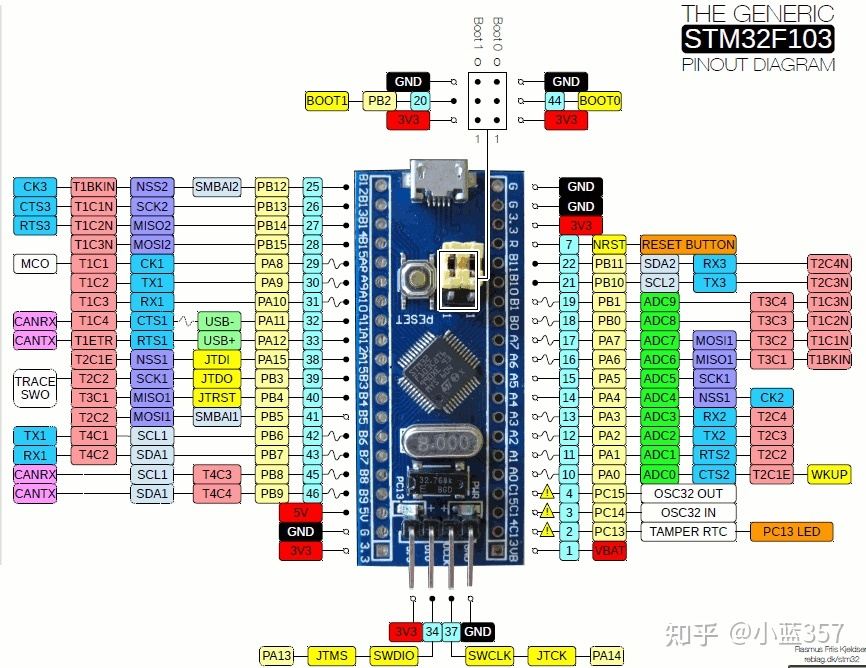

### 3. 【重点】GPIOC 可用的引脚只有 3 个

这是本实验最容易踩的坑，必须搞清楚。

STM32F103C8T6 是 **LQFP48 封装**，引脚数量有限。虽然芯片内部 **GPIOA、GPIOB、GPIOC 三个端口都是完整 16 位**的，但 C8T6 这颗芯片上：

- **GPIOA 完整引出** PA0 ~ PA15
- **GPIOB 完整引出** PB0 ~ PB15
- **GPIOC 只引出了 3 个**：**PC13、PC14、PC15**

也就是说 **PC0 ~ PC12 在排针上根本找不到**。

而这三个里面：

| 引脚 | 用途 | 能不能随便用 |
| --- | --- | --- |
| **PC13** | 板上焊接的 LED 指示灯（蓝色，低电平点亮） |  可以，本实验就用它 |
| PC14 | 接 32.768kHz 晶振一端（OSC32_IN） |  一般不用 |
| PC15 | 接 32.768kHz 晶振另一端（OSC32_OUT） |  一般不用 |

所以**如果要求"用 GPIOA、GPIOB、GPIOC 三个端口各控制一盏灯"，GPIOC 只能选 PC13**。而 PC13 又正好是板上自带的那颗 LED——我们把外接蓝灯接在这个引脚上，两盏灯就会一起闪烁，等于把板载灯也纳入了流水灯。

> ⚠️ 注意区分板上的**两颗** LED：
> 1. **红色电源指示灯**——只要给板子供上电就常亮，是电源指示用的，**程序控制不了**；
> 2. **蓝色 PC13 指示灯**——就是上面说的那颗，**程序能控制，低电平点亮**，本实验用的就是它（不同批次的板子这颗灯颜色可能不同，以实物为准；本实验中它和外接蓝灯一起闪烁）。
>
> 别把红色电源灯当成 PC13 灯，看到它亮只是说明供电正常，不代表程序跑起来了。

### 4. 上电默认主频

还有一个坑要注意：**STM32F103 上电复位后默认使用内部 8MHz 的 HSI 时钟**，并不是 72MHz。

- 如果工程里带了官方的 `system_stm32f10x.c`，启动时会调用 `SystemInit()` 把主频设成 72MHz；
- 如果只加了启动文件、没加这个文件，那就一直跑在 8MHz。

这一点直接影响后面延时函数的参数。**本实验的工程里加入了官方 `system_stm32f10x.c`**，启动时它的 `SystemInit()` 会把主频配成 **72MHz**（HSE 8MHz × PLL9），所以 led3.c 里 `SYSCLK_HZ` 按 `72000000UL` 填写。如果工程里没加这个文件（一直跑在复位后的 8MHz HSI），就把 `SYSCLK_HZ` 改成 `8000000UL`。判断标准：**实测延时比 1 秒长 9 倍，就是主频和 `SYSCLK_HZ` 不匹配**。

### 5. PC13 的两个电气限制

PC13 和普通 GPIO 不一样，它在**备份域（VBAT 供电域）**，官方手册（RM0008）明确写了两条限制：

1. **输出速度不能超过 2MHz**，负载电容不超过 30pF；
2. **只能"灌电流"，不能"拉电流"**，最大只能吸收 **3mA**，也就是说**不能让 PC13 输出高电平去驱动 LED**。

所以 PC13 的 LED 接法是：**3.3V → LED → 限流电阻 → PC13**，靠 PC13 输出低电平把电流"吸"进来点亮。这也是为什么板上那颗灯是**低电平点亮**的。

而 PA0、PB0 是普通 GPIO，单个引脚规格保证可灌/拉 **±8mA**（绝对最大 25mA），所以接法是 **PA0 → 限流电阻 → LED → GND**，输出高电平点亮。


## 二、任务：三路 LED 流水灯

### 1. 程序设计思路

#### （1）硬件电路连接

用面包板搭电路，从核心板的 3.3V 和 GND 引两根线到面包板的电源轨，然后按下表接线：

| LED | 端口 | 引脚 | 接线方式 | 点亮电平 |
| --- | --- | --- | --- | --- |
| 🟢 绿灯 | GPIOB | **PB0** | PB0 → 330Ω → LED 正极，LED 负极 → GND | **高电平**点亮 |
| 🔵 蓝灯 | GPIOC | **PC13** | 3.3V → 1kΩ → LED 正极，LED 负极 → PC13 | **低电平**点亮 |
| 🔴 红灯 | GPIOA | **PA0** | PA0 → 330Ω → LED 正极，LED 负极 → GND | **高电平**点亮 |

> **闪烁顺序：绿灯 → 蓝灯 → 红灯**，**同一时刻只有一盏灯亮**，每 1 秒切换一次，循环往复。
>
> ⚠️ 三点提醒：
> 1. **LED 必须串联限流电阻**，直接接会烧 LED 甚至烧引脚。PA0、PB0 是普通 IO，用 330Ω（电流约 3~4mA，远在 8mA 规格内）。
> 2. **PC13 的方向不能接反**。它是灌电流的，LED 正极要接 3.3V，靠 PC13 输出低电平点亮。
> 3. **外接蓝灯与板载蓝灯并联在同一个引脚 PC13 上，所以两盏灯同亮同灭**——这正好把板载灯也纳入了实验。电流核算：板载灯限流 510Ω（约 0.4mA）+ 外接蓝灯 1kΩ（约 0.2mA），合计远小于 PC13 的 3mA 上限，很安全。蓝色 LED 正向压降约 3.0V，电流天然小，所以蓝灯用 1kΩ 也不会像红绿灯那样明显变暗。

> 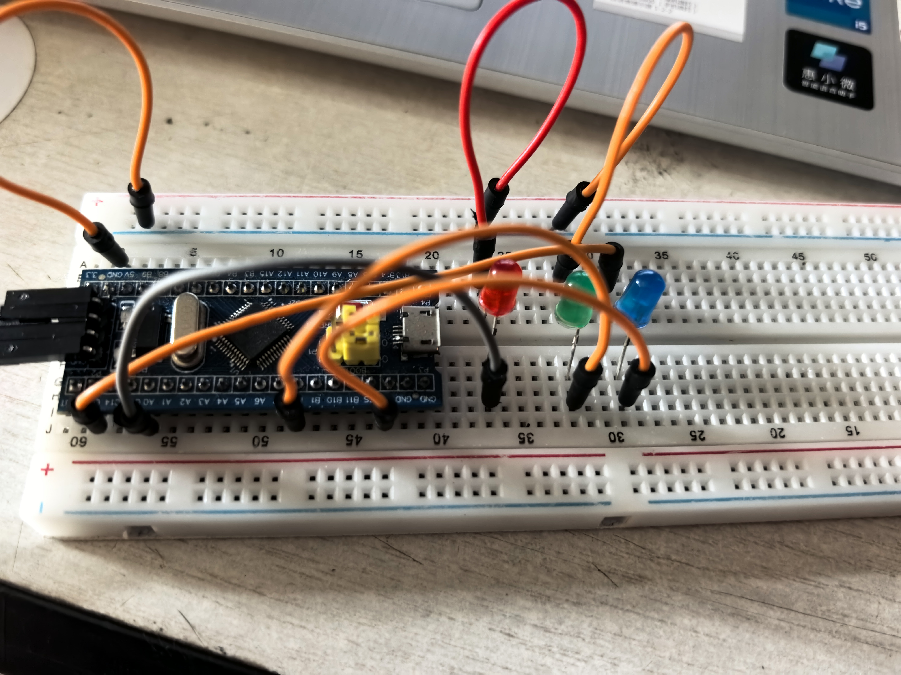

#### （2）GPIOx 端口的寄存器地址

STM32 的外设寄存器都是按固定地址映射的，全部可以在《STM32F10x 参考手册》的存储器映射表里查到。

**首先是总线和基地址：**

| 外设 | 基地址 | 挂在哪条总线上 |
| --- | --- | --- |
| RCC（时钟控制） | 0x40021000 | AHB（RCC 本身挂在 AHB 总线上；APB2ENR 只是它的一个寄存器，用来给 APB2 上的外设开门） |
| GPIOA | 0x40010800 | APB2 |
| GPIOB | 0x40010C00 | APB2 |
| GPIOC | 0x40011000 | APB2 |
| SysTick | 0xE000E010 | 内核私有 |

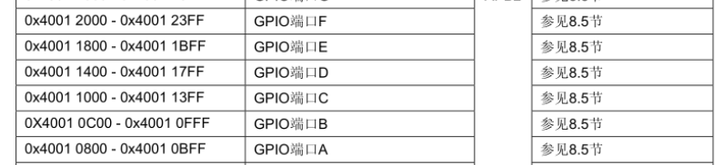
**时钟使能寄存器：**

| 寄存器 | 地址 | 说明 |
| --- | --- | --- |
| RCC_APB2ENR | **0x40021018** | bit2=IOPAEN，bit3=IOPBEN，bit4=IOPCEN |

**GPIO 端口内部寄存器（以基地址 + 偏移量得到绝对地址）：**
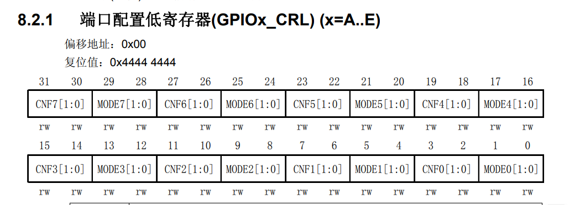
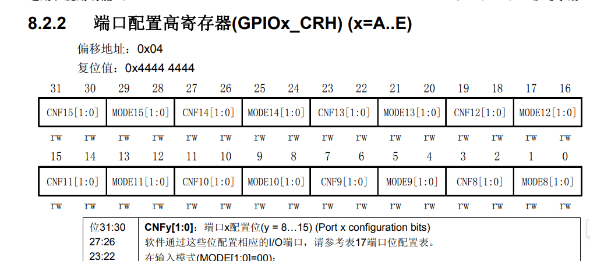

| 偏移 | 寄存器 | 作用 | GPIOA 绝对地址 | GPIOB 绝对地址 | GPIOC 绝对地址 |
| --- | --- | --- | --- | --- | --- |
| 0x00 | **CRL** | 配置低 8 位引脚 Px0~Px7 | 0x40010800 | 0x40010C00 | 0x40011000 |
| 0x04 | **CRH** | 配置高 8 位引脚 Px8~Px15 | 0x40010804 | 0x40010C04 | 0x40011004 |
| 0x08 | **IDR** | 输入数据寄存器（读引脚电平） | 0x40010808 | 0x40010C08 | 0x40011008 |
| 0x0C | **ODR** | 输出数据寄存器（写引脚电平） | 0x4001080C | 0x40010C0C | 0x4001100C |
| 0x10 | **BSRR** | 位设置/清除寄存器 | 0x40010810 | 0x40010C10 | 0x40011010 |
| 0x14 | **BRR** | 位清除寄存器 | 0x40010814 | 0x40010C14 | 0x40011014 |
| 0x18 | LCKR | 配置锁定寄存器 | 0x40010818 | 0x40010C18 | 0x40011018 |

**SysTick 寄存器（Cortex-M3 内核自带，地址固定）：**

| 寄存器 | 地址 | 作用 |
| --- | --- | --- |
| STK_CTRL | 0xE000E010 | 控制及状态寄存器 |
| STK_LOAD | 0xE000E014 | 重装载数值寄存器 |
| STK_VAL | 0xE000E018 | 当前计数值寄存器 |

#### （3）寄存器详细参数说明

**① RCC_APB2ENR（0x40021018）—— 时钟使能**
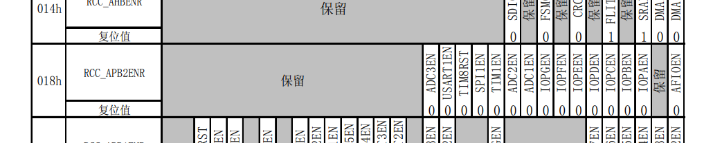


STM32 的外设默认都**没有时钟**，不使能时钟的话，往它的寄存器里写数据是**完全无效**的。所以第一步一定要：

```c
RCC_APB2ENR |= (1 << 2) | (1 << 3) | (1 << 4);
/*            GPIOA      GPIOB      GPIOC    */
```

| 位 | 名称 | 含义 |
| --- | --- | --- |
| 2 | IOPAEN | GPIOA 时钟使能 |
| 3 | IOPBEN | GPIOB 时钟使能 |
| 4 | IOPCEN | GPIOC 时钟使能 |

**② GPIOx_CRL / GPIOx_CRH —— 端口配置寄存器**

这是配置引脚"工作模式"的寄存器。CRL 管 Px0~Px7，CRH 管 Px8~Px15。**每个引脚占 4 个二进制位**，格式是：

```
bit:   [3] [2]  [1] [0]
       CNF[1:0]  MODE[1:0]
```

- **MODE[1:0]（低 2 位）**——输出速度：

| 值 | 含义 |
| --- | --- |
| 00 | 输入模式 |
| 01 | 输出模式，最大 10MHz |
| 10 | 输出模式，最大 2MHz |
| 11 | 输出模式，最大 50MHz |

- **CNF[1:0]（高 2 位）**——具体配置，输出模式下：

| 值 | 含义 |
| --- | --- |
| 00 | **通用推挽输出**（最常用，本实验用这个） |
| 01 | 通用开漏输出 |
| 10 | 复用推挽输出 |
| 11 | 复用开漏输出 |

**引脚号与位段的对应关系**（关键，容易算错）：

| 引脚 | 用哪个寄存器 | 占哪几位 |
| --- | --- | --- |
| PA0 / PB0 | CRL | bit[3:0]（第 1 组） |
| PA1 / PB1 | CRL | bit[7:4]（第 2 组） |
| PA7 | CRL | bit[31:28]（第 8 组） |
| **PC13** | **CRH** | **bit[23:20]**（13−8=5，第 6 组） |
| PA15 | CRH | bit[31:28]（第 8 组） |

所以配置的通用写法是「**先清零，再写入**」：

```c
GPIOA_CRL &= ~(0xF << 0);   /* 把 bit[3:0] 这 4 位清零 */
GPIOA_CRL |=  (0x3 << 0);   /* 写入 0b0011 = 50MHz 通用推挽输出 */
```

> 💡 STM32F1 的一个特殊限制（和 F4/F7 不一样）：GPIO 寄存器**必须按 32 位字（word）访问**，不允许半字（16 位）或字节（8 位）访问（RM0008 §9.1）。所以寄存器指针都用 32 位的 `volatile unsigned int *`，上面的宏定义天然满足这个要求。

**③ GPIOx_BSRR（位设置/清除寄存器）—— 控制电平**

这是一个 32 位寄存器，**专门用来单独修改某个引脚，不影响同端口的其它引脚**：

| 位段 | 作用 |
| --- | --- |
| 低 16 位 bit0~bit15 | 写 1 → 对应引脚**输出高电平**；写 0 → **不变** |
| 高 16 位 bit16~bit31 | 写 1 → 对应引脚**输出低电平**；写 0 → **不变** |

举例说明：

```c
GPIOA_BSRR = (1 << 0);          /* PA0 输出高电平（bit0 置 1） */
GPIOA_BSRR = (1 << (0 + 16));   /* PA0 输出低电平（bit16 置 1） */
GPIOC_BSRR = (1 << 13);         /* PC13 输出高电平 */
GPIOC_BSRR = (1 << (13 + 16));  /* PC13 输出低电平，即 1<<29 */
```

**为什么用 BSRR 而不是 ODR？**

ODR 也能控制电平，但它需要「读出→修改→写回」三步（`ODR = (ODR & ~mask) | value`），如果中途被中断打断，就可能出错。**BSRR 是原子操作**，一条指令搞定，写 1 有效、写 0 不影响其它位，更安全也更高效。

**④ SysTick 相关寄存器 —— 精确延时**

用空循环 `for(i=0;i<100000;i++);` 做延时不准确（换个编译器优化等级时间就变了）。Cortex-M3 内核自带的 SysTick 定时器可以做出精确延时。

| 寄存器 | 位 | 含义 |
| --- | --- | --- |
| STK_CTRL | bit0 | ENABLE，1 = 使能定时器 |
| | bit1 | TICKINT，1 = 计数到 0 时产生中断（本实验不需要，置 0） |
| | bit2 | CLKSOURCE，1 = 使用内核时钟，0 = 使用外部时钟 |
| | bit16 | COUNTFLAG，计数到 0 时硬件置 1，**读该寄存器即清零** |
| STK_LOAD | bit23:0 | 重装载值，计数到此值后归零 |
| STK_VAL | bit23:0 | 当前计数值，写任意值即可清零 |

主频 72MHz 时，1ms 需要计 72000 次，所以：

```c
STK_LOAD = 72000000 / 1000 - 1;  /* = 71999 */
STK_CTRL = 0x05;                 /* 0b101：使能 + 内核时钟 */
while ((STK_CTRL & (1 << 16)) == 0);  /* 等 COUNTFLAG 置位，正好 1ms */
```

#### （4）程序流程

```
开始
 │
 ├─ 1. 使能 GPIOA / GPIOB / GPIOC 的时钟      （RCC_APB2ENR）
 │
 ├─ 2. 配置 PB0（绿灯）为 50MHz 通用推挽输出    （GPIOB_CRL bit[3:0] = 0b0011）
 │
 ├─ 3. 配置 PA0（红灯）为 50MHz 通用推挽输出    （GPIOA_CRL bit[3:0] = 0b0011）
 │
 ├─ 4. 配置 PC13（蓝灯）为 2MHz 通用推挽输出    （GPIOC_CRH bit[23:20] = 0b0010）
 │
 ├─ 5. 三盏灯全部熄灭
 │
 └─ 6. while(1) 死循环，每拍延时 1 秒：
        ├─ 第1拍：绿灯亮（PB0=1），红蓝熄灭
        ├─ 第2拍：蓝灯亮（PC13=0，与板载蓝灯一起），绿红熄灭
        └─ 第3拍：红灯亮（PA0=1），绿蓝熄灭 → 回到第1拍，如此往复
```

---

### 2. 寄存器方式 C 代码（详细注解）

```c
/**
 * ============================================================
 *  文件名 : led3.c
 *  芯片   : STM32F103C8T6 (Blue Pill 最小系统核心板)
 *  功能   : 寄存器方式实现三路流水灯（与实验现象一致）
 *           闪烁顺序：绿灯(PB0) -> 蓝灯(PC13) -> 红灯(PA0)
 *           同一时刻只有一盏灯亮，每 1 秒切换一次，循环往复
 *  接线   : 绿灯  PB0  -> 330Ω -> LED -> GND      （高电平点亮）
 *           蓝灯  3.3V -> 1kΩ -> LED -> PC13      （低电平点亮）
 *                 外接蓝灯与板载蓝灯并联在同一个引脚上，两盏一起闪烁
 *           红灯  PA0  -> 330Ω -> LED -> GND      （高电平点亮）
 *  说明   : 不使用任何库函数，直接操作寄存器。
 *           工程里需加入官方 system_stm32f10x.c（提供 SystemInit，
 *           把主频配置为 HSE 8MHz × PLL9 = 72MHz）
 * ============================================================
 */

/* ==================== 一、寄存器地址定义 ==================== */
/* 参考《STM32F10x 中文参考手册》RM0008 的存储器映射表 */

/* --- 1.1 RCC 复位与时钟控制 --- */
#define RCC_APB2ENR  (*(volatile unsigned int *)0x40021018)  /* APB2 外设时钟使能寄存器 */

/* --- 1.2 GPIOA，基地址 0x40010800 --- */
#define GPIOA_CRL    (*(volatile unsigned int *)0x40010800)  /* 端口配置低寄存器  PA0 ~ PA7  */
#define GPIOA_CRH    (*(volatile unsigned int *)0x40010804)  /* 端口配置高寄存器  PA8 ~ PA15 */
#define GPIOA_IDR    (*(volatile unsigned int *)0x40010808)  /* 端口输入数据寄存器 */
#define GPIOA_ODR    (*(volatile unsigned int *)0x4001080C)  /* 端口输出数据寄存器 */
#define GPIOA_BSRR   (*(volatile unsigned int *)0x40010810)  /* 端口位设置/清除寄存器 */
#define GPIOA_BRR    (*(volatile unsigned int *)0x40010814)  /* 端口位清除寄存器 */

/* --- 1.3 GPIOB，基地址 0x40010C00 --- */
#define GPIOB_CRL    (*(volatile unsigned int *)0x40010C00)
#define GPIOB_CRH    (*(volatile unsigned int *)0x40010C04)
#define GPIOB_IDR    (*(volatile unsigned int *)0x40010C08)
#define GPIOB_ODR    (*(volatile unsigned int *)0x40010C0C)
#define GPIOB_BSRR   (*(volatile unsigned int *)0x40010C10)
#define GPIOB_BRR    (*(volatile unsigned int *)0x40010C14)

/* --- 1.4 GPIOC，基地址 0x40011000 --- */
#define GPIOC_CRL    (*(volatile unsigned int *)0x40011000)
#define GPIOC_CRH    (*(volatile unsigned int *)0x40011004)
#define GPIOC_IDR    (*(volatile unsigned int *)0x40011008)
#define GPIOC_ODR    (*(volatile unsigned int *)0x4001100C)
#define GPIOC_BSRR   (*(volatile unsigned int *)0x40011010)
#define GPIOC_BRR    (*(volatile unsigned int *)0x40011014)

/* --- 1.5 Cortex-M3 内核自带的 SysTick 定时器 --- */
#define STK_CTRL     (*(volatile unsigned int *)0xE000E010)  /* 控制及状态寄存器 */
#define STK_LOAD     (*(volatile unsigned int *)0xE000E014)  /* 重装载数值寄存器 */
#define STK_VAL      (*(volatile unsigned int *)0xE000E018)  /* 当前数值寄存器 */


/* ==================== 二、延时函数 ==================== */
/* 系统主频（延时基准）：工程里的 system_stm32f10x.c 启动时已把主频
   配成 72MHz（HSE 8MHz × PLL9），所以这里填 72000000UL。
   自检：实测延时比 1 秒长 9 倍（约 9 秒一拍），说明实际跑在 8MHz
   （工程里没加 system_stm32f10x.c），把这里改成 8000000UL 即可 */
#define SYSCLK_HZ   72000000UL

/**
 * @brief  毫秒级延时，基于内核 SysTick 计数器
 * @param  ms 需要延时的毫秒数
 */
static void delay_ms(unsigned int ms)
{
    unsigned int i;

    STK_LOAD = SYSCLK_HZ / 1000 - 1;  /* 1ms 对应的计数值，72MHz 下为 71999 */
    STK_VAL  = 0;                     /* 清空当前计数值 */
    STK_CTRL = 0x05;                  /* bit2=1 用内核时钟，bit0=1 使能，bit1=0 关中断 */

    for (i = 0; i < ms; i++)
    {
        /* bit16 是 COUNTFLAG，计数器递减到 0 时硬件自动置 1；
           读一次该寄存器就会把它清 0，所以这个循环正好等 1ms */
        while ((STK_CTRL & (1u << 16)) == 0)
        {
            /* 空等 */
        }
    }

    STK_CTRL = 0;   /* 延时结束，关闭 SysTick 省电 */
}


/* ==================== 三、GPIO 初始化 ==================== */
/**
 * @brief  把 PB0（绿灯）、PA0（红灯）配成 50MHz 推挽输出，
 *         PC13（蓝灯）配成 2MHz 推挽输出，并全部熄灭
 */
static void LED_Init(void)
{
    /* --- 3.1 使能三个端口的时钟 ---
       STM32 的 GPIO 默认没有时钟，不使能的话写寄存器无效
       RCC_APB2ENR: bit2 = IOPAEN(GPIOA)  bit3 = IOPBEN(GPIOB)  bit4 = IOPCEN(GPIOC) */
    RCC_APB2ENR |= (1u << 2) | (1u << 3) | (1u << 4);

    /* --- 3.2 PB0（绿灯）配置 ---
       CRL 每 4 个二进制位管一个引脚，PB0 占 bit[3:0]
       这 4 位的含义是 CNF[1:0] + MODE[1:0]
       输出模式 CNF = 00 表示通用推挽，MODE = 11 表示输出 50MHz
       所以写入 0b0011 = 0x3 */
    GPIOB_CRL &= ~(0xFu << 0);   /* 先清零这 4 位，避免影响其它引脚 */
    GPIOB_CRL |=  (0x3u << 0);   /* 再写入 0b0011 */

    /* --- 3.3 PA0（红灯）配置，与 PB0 同理，占 GPIOA_CRL 的 bit[3:0] --- */
    GPIOA_CRL &= ~(0xFu << 0);
    GPIOA_CRL |=  (0x3u << 0);

    /* --- 3.4 PC13（蓝灯）配置 ---
       PC13 属于高 8 位，要用 CRH
       13 - 8 = 5，所以占 bit[23:20]（第 5 组 4 位）
       PC13 在备份域，官方手册要求速度不超过 2MHz
       所以 MODE = 10，CNF = 00，写入 0b0010 = 0x2 */
    GPIOC_CRH &= ~(0xFu << 20);
    GPIOC_CRH |=  (0x2u << 20);

    /* --- 3.5 上电先把三盏灯全部熄灭 ---
       PA0、PB0 是高电平点亮，所以输出 0
       PC13 是低电平点亮，所以输出 1
       BSRR 低 16 位写 1 表示置位（输出高），高 16 位写 1 表示复位（输出低） */
    GPIOA_BSRR = (1u << 16);   /* PA0  = 0，红灯灭 */
    GPIOB_BSRR = (1u << 16);   /* PB0  = 0，绿灯灭 */
    GPIOC_BSRR = (1u << 13);   /* PC13 = 1，蓝灯灭 */
}


/* ==================== 四、主函数 ==================== */
int main(void)
{
    LED_Init();   /* 先初始化硬件，三盏灯全部熄灭 */

    while (1)     /* 死循环，单片机程序永远不退出 */
    {
        /* ---------- 第 1 拍：绿灯亮，红、蓝熄灭 ---------- */
        GPIOB_BSRR = (1u << 0);          /* PB0  = 1 -> 绿灯亮 */
        GPIOA_BSRR = (1u << 16);         /* PA0  = 0 -> 红灯灭 */
        GPIOC_BSRR = (1u << 13);         /* PC13 = 1 -> 蓝灯灭（低电平点亮） */
        delay_ms(1000);                  /* 保持 1 秒 */

        /* ---------- 第 2 拍：蓝灯亮，绿、红熄灭 ---------- */
        /* PC13 输出低电平点亮：写 BSRR 高 16 位（bit 13+16=29）把该引脚清零。
           外接蓝灯和板载蓝灯都接在 PC13 上，所以两盏灯一起亮 */
        GPIOC_BSRR = (1u << (13 + 16));  /* PC13 = 0 -> 蓝灯亮（与板载蓝灯一起闪） */
        GPIOB_BSRR = (1u << 16);         /* PB0  = 0 -> 绿灯灭 */
        GPIOA_BSRR = (1u << 16);         /* PA0  = 0 -> 红灯保持灭 */
        delay_ms(1000);

        /* ---------- 第 3 拍：红灯亮，绿、蓝熄灭 ---------- */
        GPIOA_BSRR = (1u << 0);          /* PA0  = 1 -> 红灯亮 */
        GPIOB_BSRR = (1u << 16);         /* PB0  = 0 -> 绿灯灭 */
        GPIOC_BSRR = (1u << 13);         /* PC13 = 1 -> 蓝灯灭 */
        delay_ms(1000);
        /* 循环回到第 1 拍：任何时刻只有一盏灯亮 */
    }
}
```

---

## 三、编译、烧录与实验现象

### 1. 开发环境

| 项目 | 选择 |
| --- | --- |
| IDE | Keil MDK 5（需装 STM32F1 器件包）/ STM32CubeIDE |
| 编译器 | ARMCC 或 arm-none-eabi-gcc |
| 下载器 | ST-Link V2 |
| 下载方式 | SWD |

### 2. 接线

把 ST-Link 的 4 根线接到核心板顶部的下载排针上：

| ST-Link | 核心板 |
| --- | --- |
| 3.3V | 3.3V |
| GND | GND |
| SWDIO | SWDIO（PA13） |
| SWCLK | SWCLK（PA14） |

> 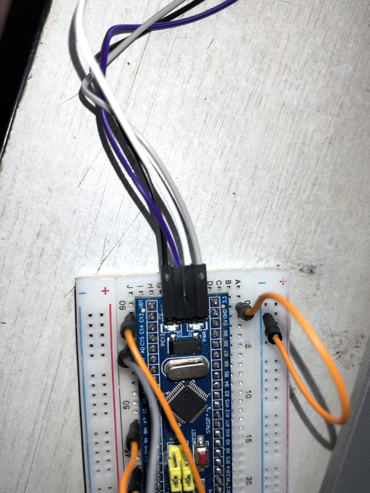
> 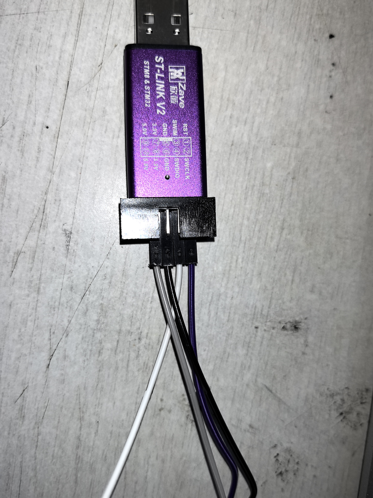

### 3. 烧录步骤

1. Keil 中新建工程，选择器件 **STM32F103C8**；
2. 在工程里加启动文件 `startup_stm32f10x_md.s`（**md** 表示中容量，C8T6 属于中容量产品）；
3. 新建 `led3.c`，把代码粘进去（本文件自带空的 `SystemInit()`，工程里**不需要**再加 `system_stm32f10x.c`）；
4. 打开魔术棒 → Debug 选项卡 → 选 **ST-Link Debugger** → Settings → Flash Download 勾选 **Reset and Run**；
5. 编译（F7）→ 下载（F8）

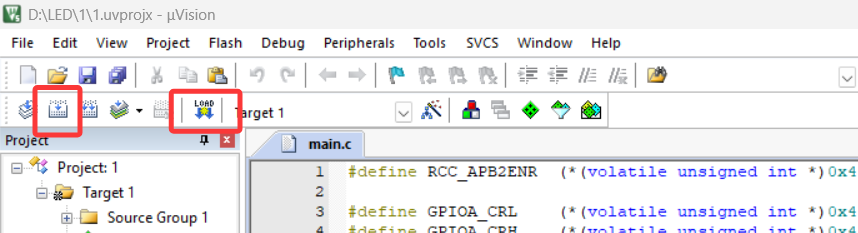

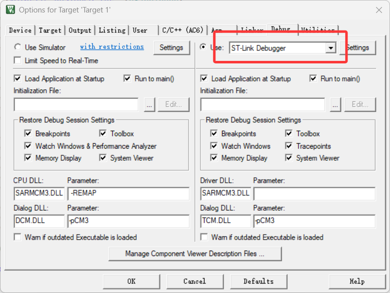
### 4. 实验现象

烧录后板子上的效果（与代码逐拍对应，每拍间隔恰好 1 秒）：

| 时刻 | 现象 |
| --- | --- |
| 第 1 秒 | 只有**绿灯**亮 |
| 第 2 秒 | **蓝灯**亮（外接蓝灯与板载蓝灯同引脚，一起亮），绿灯熄灭 |
| 第 3 秒 | **红灯**亮，蓝灯熄灭 |
| 之后 | 回到第 1 秒重新开始，循环往复——**任何时刻都只有一盏灯亮** |

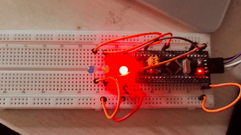


### 5. 调试中遇到的坑

| 现象 | 原因 | 解决 |
| --- | --- | --- |
| 所有灯都不亮 | 忘记使能 GPIO 时钟 | 加 `RCC_APB2ENR |= (1<<2)|(1<<3)|(1<<4);` |
| PC13 灯亮灭反了 | PC13 是**低电平点亮** | 点灯时写 BSRR 高 16 位 `(1<<(13+16))` |
| PC13 不亮 | LED 接反了，接成了拉电流 | 改成 3.3V → LED → 电阻 → PC13 |
| 间隔不是 1 秒 | 主频是 8MHz 而不是 72MHz | 把 `SYSCLK_HZ` 改成 `8000000UL` |

---

## 四、实验心得

这次实验是我第一次真正接触单片机底层，收获很大。

最大的体会是**"看手册"的重要性**。以前写程序习惯了调用现成的函数，这次要用纯寄存器操作，每一个地址、每一个位的含义都得自己去《STM32F10x 参考手册》里查。比如 GPIO 配置寄存器，一开始我完全不明白为什么要写 `0x3`，后来才搞懂那 4 个二进制位是有讲究的——低 2 位是速度、高 2 位是推挽/开漏。搞懂这一层之后，寄存器操作反而比库函数更清晰，因为我知道每一步到底发生了什么。

第二个深刻的点是**"时钟不使能，寄存器写了也白写"** `RCC_APB2ENR` 的时钟使能。这个坑让我牢牢记住。我第一次烧录程序时灯死活不亮，代码检查了好几遍都没问题，后来才发现是漏了了 STM32 的低功耗设计思路。

第三个点是 **PC13 的特殊性**。我一开始想当然地按普通 GPIO 去驱动它，结果发现手册里明确写了它只能灌电流、最大 3mA、速度不能超过 2MHz。这也解释了为什么板载 LED 是低电平点亮的。查原理图确认接法之后才恍然大悟——**硬件设计和软件编程是分不开的**，不看原理图就写代码，很容易掉坑。
